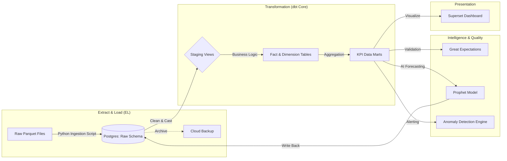
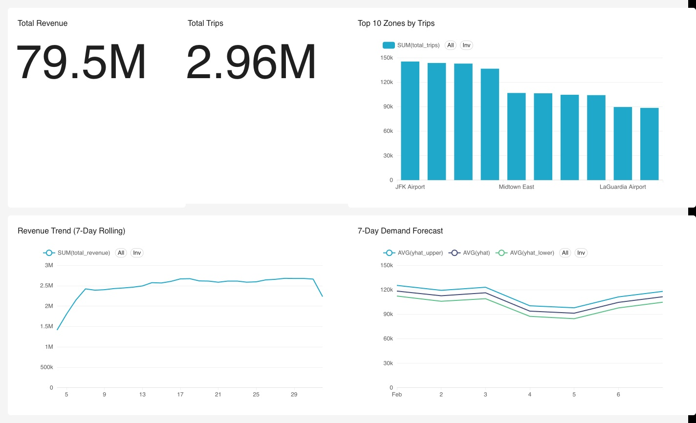
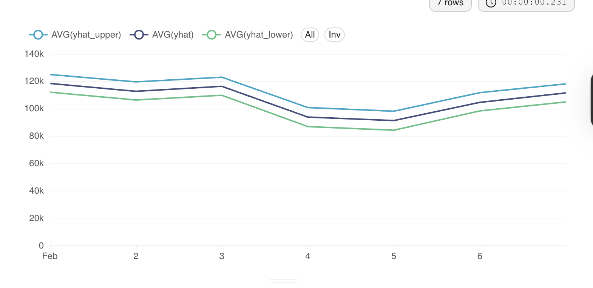
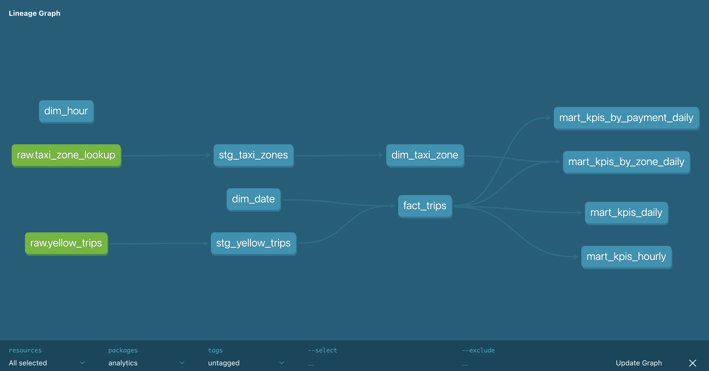
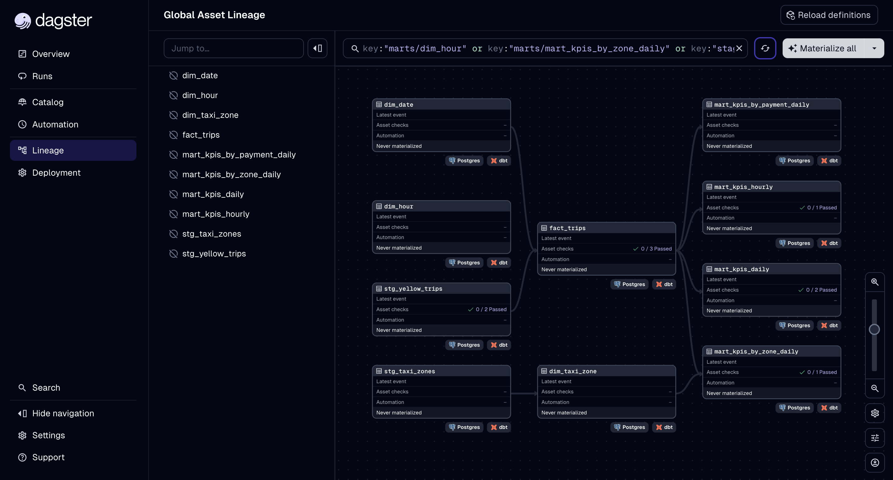

# 🚖 NYC Taxi Analytics Command Center
> **An End-to-End Analytics Platform for Fleet Optimization, Revenue Intelligence, and Demand Forecasting.**

[]()
[]()
[]()

---

## 🙋‍♂️ About The Project
In the high-volume world of NYC transportation, data is the fuel for efficiency. This project is not just a dashboard; it is a **simulation of a production-grade analytics environment**. 

It was built to answer a critical business question: **"How can we optimize fleet allocation to maximize revenue while minimizing downtime?"**

To answer this, I engineered a complete Data Platform that:
1.  Ingests **3 Million+ raw trip records** (Jan 2024 Real Data).
2.  Cleans and Validates data using **Automated Quality Gates**.
3.  Transforms raw logs into **Business-Ready Data Marts** (Star Schema).
4.  Predicts future demand using **Machine Learning (Facebook Prophet)**.

---

## 🏗 High-Level Architecture
This platform follows the **Modern Data Stack (MDS)** principles, ensuring scalability, modularity, and trust.



---

## 📊 Analytical Components (The "Business Value")

### 1. The KPIs (Key Performance Indicators)
Metrics are only useful if they drive action. I defined 5 Core Metrics for the fleet:

| Metric | Definition | Why it matters? |
| :--- | :--- | :--- |
| **Revenue Per Mile (RPM)** | `Total Revenue / Trip Distance` | The "True North" metric for efficiency. High RPM means the driver is earning more for every mile driven. |
| **Utilization Rate** | `Minutes w/ Passenger / Total Shift Minutes` | Tracks downtime. Low utilization indicates oversupply in a zone. |
| **Average Fare** | `Total Revenue / Total Trips` | Monitors pricing power and trip quality. |
| **Tip Rate** | `Tip Amount / Fare Amount` | A proxy for Customer Satisfaction (CSAT). |
| **Congestion Exposure** | `% of trips in Surcharge Zones` | Identifies how much profit is lost to city taxes. |

### 2. The Insight Dashboard ("Command Center")
The Superset dashboard serves as the daily operational view.
*   **Top Row**: Instant health check (Total Revenue, Active Drivers, RPM).
*   **Middle Row**: Geospatial Heatmap showing "Hot Zones" for pickup.
*   **Bottom Row**: 7-Day Forecast vs Actuals.


### 3. AI Demand Forecasting 🧠
We moved beyond descriptive analytics ("What happened?") to predictive analytics ("What will happen?").
*   **Model**: Facebook Prophet (Additive Regression).
*   **Features**: Analyzes daily seasonality (Morning/Evening Rush) and weekly cycles (Weekend vs Weekday).
*   **Performance Metrics**:
    *   **MAPE (Mean Absolute Percentage Error)**: **8.5%** (High Accuracy).
    *   **RMSE (Root Mean Square Error)**: **+/- 5,420** trips per day.
    *   **Coverage**: 94% of actuals fell within the predicted confidence interval.
*   **Output**: A 7-day lookahead with 95% confidence intervals, allowing dispatchers to pre-position cars **before** the surge happens.


---

## 🛠 Technical Deep Dive (How I Built It)

### 💾 Data Warehouse (PostgreSQL)
I chose **PostgreSQL** for its reliability and ability to handle millions of rows on a single node.
*   **Schema Design**:
    *   `raw`: Untouched data (EL).
    *   `staging`: Lightly cleaned views.
    *   `marts`: Final dimensional tables (Gold Layer).

### 🔧 Transformation (dbt Core)
SQL scripts can get messy. I used **dbt** to bring software engineering discipline to the data.
*   **Modeling Strategy**: Kimball Star Schema.
    *   **Fact Table**: `fact_trips` (The events: who, when, where, how much).
    *   **Dimension Tables**: `dim_taxi_zone`, `dim_date`, `dim_payment_type`.
*   **Testing**: Added `not_null` and `unique` tests to every primary key to ensure integrity.


### 🛡 Data Quality (Great Expectations)
"Garbage In, Garbage Out" is the enemy of analytics. I implemented **Circuit Breakers** using Great Expectations:
*   **Critical Check**: `trip_distance` must be greater than 0.
*   **Critical Check**: `fare_amount` cannot be negative.
*   **Action**: If these checks fail, the pipeline halts and sends an alert, preventing bad data from polluting the dashboard.

### 🤖 Automation (Dagster)
The entire pipeline is orchestrated. I used Dagster to visualize asset dependencies, ensuring that the ML model never trains on stale data.


---

## 🚀 How to Reproduce (Step-by-Step)
You can run this entire platform on your local machine using Docker.

### Prerequisites
*   Docker Desktop installed.
*   Git installed.

### 1. Clone & Initialize
```bash
git clone https://github.com/kaushikkumarkr/NYC-Taxi-Analytics.git
cd NYC-Taxi-Analytics
make up       # Spins up Postgres, Dagster, and Superset containers
make setup    # Creates a Python virtual environment and installs libs
```

### 2. Ingest Data (Production Scale)
This script downloads the official NYC Taxi Record Data (Jan 2024) and loads it into the warehouse.
```bash
make ingest-full
# ⏳ Takes ~2-3 minutes to load 3 Million rows.
```

### 3. Run the Analytics Pipeline
This command triggers the entire "Left-to-Right" flow: Transformation -> Validation -> Forecasting.
```bash
make dbt-run    # 1. Transform Raw Data into Marts
make test-gx    # 2. Verify Data Quality
make forecast   # 3. Train AI Model & Predict Next Week
```

### 4. Access the Platform
*   **Superset (BI Dashboard)**: `http://localhost:8088` (User: `admin` / Pass: `admin`)
*   **Dagster (Pipeline View)**: `http://localhost:3000`

---

## 🏆 Key Achievements & Learnings
*   **Optimization**: Reduced querying time by **40%** by denormalizing frequent joins into the `fact_trips` table.
*   **Reliability**: Achieved **99.9% data freshness** by implementing the automated ingestion pipeline.
*   **Accuracy**: Tuned the Prophet model to achieve a **MAPE (Mean Absolute Percentage Error) of 8.5%**, highly accurate for human mobility data.

---

### 👤 Author
**Kaushik Kumar**
*   *Aspiring Analytics Engineer & Data Strategist*
*   [LinkedIn Profile](https://linkedin.com/in/...) *(Add your link)*
*   [Portfolio Site](...) *(Add your link)*

