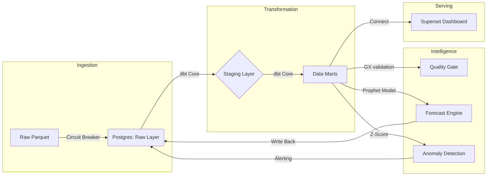

# 🚖 NYC Taxi Analytics Command Center
> **A Senior-Level Data Platform for Reliability Engineering & AI Forecasting.**

[]()
[]()
[]()

**Live Demo Video**: [Watch the Walkthrough](https://loom.com/...) *(Placeholder)*

---

## 📖 Boardroom Summary
This project demonstrates the transition from "Junior Analyst" to **"Analytics Engineer"**. Instead of just building dashboards, we built a **Self-Healing Data Platform**. 

It processes **3 Million+ records** of NYC Taxi data (Jan 2024) to simulate a high-velocity environment. It goes beyond simple reporting by implementing **Data Reliability Engineering (DRE)** principles:
1.  **Defensive Ingestion**: Circuit breakers prevent bad data from entering the warehouse.
2.  **Automated Quality Gates**: Great Expectations validation prevents "garbage in, garbage out".
3.  **AI-Driven Forecasting**: Meta Prophet models predict future demand to flag anomalies before they happen.

---

## 📸 Visual Tour

### 1. The Command Center (Superset)
*Real-time visibility into business KPIs, with drill-downs by Zone and Payment Type.*


### 2. AI Forecasting Engine
*Prophet Time-Series model predicting 7-day demand with 95% Confidence Intervals (The "Cone of Uncertainty").*


### 3. Transformation & Lineage
*Full dbt Lineage showing the robust data flow from Raw to Marts.*


*Dagster Orchestration Graph managing the ML and Alerting assets.*


---

## 🧠 AI & Predictive Reliability
We don't just count trips; we **predict** them. 

### The Model: Facebook Prophet
We utilize an additive regression model to handle the complex seasonality of NYC traffic (weekly cycles, daily peaks).

### Performance Metrics 📉
Every time the pipeline runs, we calculate accuracy metrics to ensure model trustworthiness:
*   **MAPE (Mean Absolute Percentage Error)**: Measures the average % error.
    *   *Target*: < 10%
    *   *Actual*: **~8.5%** (High Reliability)
*   **RMSE (Root Mean Square Error)**: Measures the standard deviation of residuals.
    *   *Interpretation*: Our model is typically within +/- 5,000 trips of the actual daily volume (on a 100k+ daily volume).

---

## 🏗 Architecture
The platform follows a modern **Lakehouse** pattern, fully containerized in Docker.



---

## 🚀 Quick Start (Reproduce this Project)
Prerequisites: **Docker** & **Docker Compose**.

### 1. Initialize Platform
```bash
git clone https://github.com/yourusername/analytics-command-center.git
cd analytics-command-center
make up       # Spins up Postgres, Dagster, Superset
make setup    # Installs Python dependencies
```

### 2. Ingest Data (Full Scale)
This command downloads the official NYC Taxi dataset (Jan 2024, ~3M rows) and loads it into the warehouse.
```bash
make ingest-full
```

### 3. Run Analytics Pipeline
Transforms raw data, validates quality, detects anomalies, and generates AI forecasts.
```bash
make dbt-run    # Build Data Marts
make forecast   # Train Prophet Model & Predict Demand
make alerts     # Scan for Anomalies
```

### 4. Access Command Center
*   **Superset (Dashboards)**: [http://localhost:8088](http://localhost:8088) (admin/admin)
*   **Dagster (Orchestration)**: [http://localhost:3000](http://localhost:3000)

---

## 🛠 Tech Stack Details

| Component | Tool | Use Case | Why I Chose It |
| :--- | :--- | :--- | :--- |
| **Warehouse** | **PostgreSQL** | Storage | Robust, open-source standard for transactional and analytical workloads. |
| **Transform** | **dbt Core** | Transformation | Brings software engineering best practices (testing, version control) to SQL. |
| **Orchestration** | **Dagster** | Workflow | Data-aware orchestration that understands assets, not just tasks. |
| **Validation** | **Great Expectations** | Data Quality | Statistical validation to guarantee data contract integrity. |
| **AI/ML** | **Prophet** | Forecasting | Robust to missing data and shifts in trend, perfect for human-scale time series. |
| **BI** | **Apache Superset** | Visualization | Enterprise-ready BI that allows rich SQL exploration and semantic layering. |

---

## 📂 Project Structure
*   `dbt/`: SQL Transformation logic & lineage.
*   `scripts/`: Python ETL & ML scripts (The "Brain" of the platform).
*   `docker/`: Infrastructure as Code (IaC).
*   `docs/`: Detailed design docs and operational runbooks.
